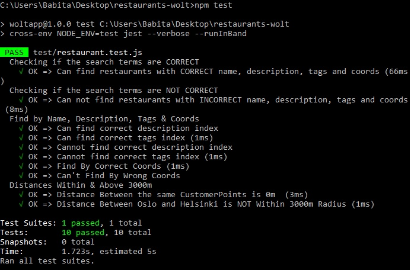

                    # To run this project

- npm install
- nodemon index.js
  - node_modules/.bin/nodemon index.js

[Run Locally](http://localhost:3001/restaurants/search/sushi/60.17045/24.93147) : http://localhost:3001/restaurants/search/sushi/60.17045/24.93147 or http://localhost:3001/restaurants

                    # Technologies

- NodeJS, Express, ES6, JSX Syntaxing (Backend)
- Jest
- geolib library for distance calculation based on coordinates

# Features

- Restaurant data are stored in JavaScript object module but parsed to JSON while sending
- Get all data: http://localhost:3001/restaurants or sorted data e.g.-: http://localhost:3001/restaurants/search/sushi/60.17045/24.93147
- Based on customer location, searches all the Restaurants within 3km
- Refines the search more by searching (within 3km) all the restaurants with name or tags or description matches and gives back JSON to browser

###### Test Result Screen Shot

